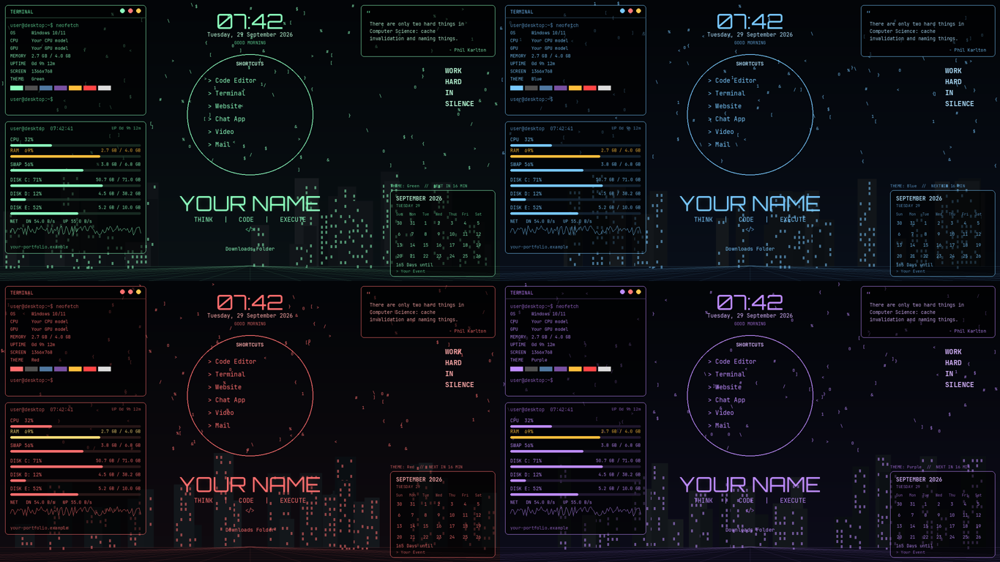

<div align="center">

# HackerVibe Desktop UI

**A cyberpunk-themed Rainmeter desktop suite for Windows.**
Clock · Calendar · Weather · System Monitor · Network · Terminal Stats · Quotes · Shortcuts

[](https://www.rainmeter.net)
[](#requirements)
[](LICENSE)
[](Skins/HackerSuite/@Resources/Fonts)



</div>

---

## Overview

HackerVibe Desktop UI is a full desktop widget suite built on Rainmeter.
It ships with **4 switchable color themes** — Green, Blue, Red, Purple —
that recolor every widget *and* swap the desktop wallpaper in sync, either
manually with one click or automatically on a timer.

The installer is interactive: it asks for your name and links once, then
generates a personalized wallpaper and wires up every config for your
machine. No file in this repo hard-codes anyone's username, file paths, or
personal details — it's built to be cloned and set up by anyone.

## Features

| Widget | Description |
|---|---|
| **Clock** | Time, date, a rotating motto, and year/week progress |
| **Calendar** | Full month view with a countdown to an event you set |
| **Weather** | Live conditions via [Open-Meteo](https://open-meteo.com) — free, no API key |
| **System Status** | CPU / RAM / disk usage with color-coded warning thresholds |
| **Network** | Ping latency and live upload/download speed |
| **Terminal** | `neofetch`-style OS / CPU / GPU / uptime readout |
| **Quote** | Rotates quotes from an editable text file |
| **Shortcuts** | One-click launchers for your editor, site, and downloads folder |
| **ThemeCycler** | Rotates wallpaper + all widgets through the 4 themes on a timer |

## Requirements

- Windows 10 or 11
- [Rainmeter](https://www.rainmeter.net) 4.4+ (`winget install Rainmeter.Rainmeter`)

## Installation

```bash
git clone https://github.com/tawsif-frontend-dev/HackerVibe-DesktopUI.git
cd HackerVibe-DesktopUI
install.bat
```

Or download the ZIP (`Code → Download ZIP`) and double-click `install.bat`.

The installer will:

1. Locate your Rainmeter install and skins folder automatically
2. Ask for your name, portfolio/GitHub link, and a countdown event
3. Copy the skin into `Documents\Rainmeter\Skins`
4. Render your personalized wallpaper in all 4 theme colors
5. Install the bundled fonts for your user account
6. Load every widget in Rainmeter

Run `install.bat` again any time to update your name or links.

<details>
<summary><strong>Prefer a manual install?</strong></summary>

See [`Skins/HackerSuite/README.txt`](Skins/HackerSuite/README.txt) for
step-by-step manual installation, manual theme switching, and how to add
your own quotes.
</details>

## Configuration

Everything lives in one file:
[`Skins/HackerSuite/@Resources/Settings.inc`](Skins/HackerSuite/@Resources/Settings.inc).
Right-click any widget → **Edit settings**, make a change, then
**Refresh all** to apply it. Theme switching never touches this file.

## Switching Themes

Right-click any widget → **Theme → Green / Blue / Red / Purple**. This
instantly recolors every widget and updates the wallpaper together.

To cycle automatically, load `ThemeCycler.ini` from Rainmeter's manage
window — it rotates through all 4 themes on a timer you set in
`Settings.inc` (`ThemeCycleMinutes`).

## Rebuilding Wallpapers

The wallpapers ship pre-rendered with a placeholder name. To regenerate
them with your own (this also happens automatically during install):

```bash
pip install pillow
python tools/make_wallpapers.py "YOUR NAME"
```

This reads the nameless base art in `@Resources/Wallpaper/Base/` and
renders your name onto all 4 theme colors.

## Project Structure

```
HackerVibe-DesktopUI/
├── install.bat / install.ps1     # One-click Windows installer
├── tools/
│   ├── make_wallpapers.py        # Wallpaper text renderer
│   └── build_rmskin.py           # Packages a .rmskin installer
└── Skins/HackerSuite/
    ├── Clock/ Calendar/ Weather/ ...   # One .ini per widget
    └── @Resources/
        ├── Settings.inc           # All user-facing config
        ├── Themes/ Variables*.inc # Color themes
        ├── Wallpaper/             # Generated + base art
        ├── Fonts/                 # Bundled, open-licensed fonts
        └── Scripts/               # Lua: theme engine, quote rotator
```

## Contributing

Issues and pull requests are welcome — new themes, widgets, or bug fixes
all fit. Please keep any new config generic (no hard-coded personal paths
or names); route user-specific values through `Settings.inc` instead.

## License

Code is licensed under [MIT](LICENSE). Bundled fonts (JetBrains Mono,
Orbitron, Open Sans, Roboto) keep their own SIL Open Font License — see
`Skins/HackerSuite/@Resources/Fonts/OFL-*.txt`.

---

<div align="center">
If this saved you some setup time, a ⭐ on the repo helps others find it.
</div>
